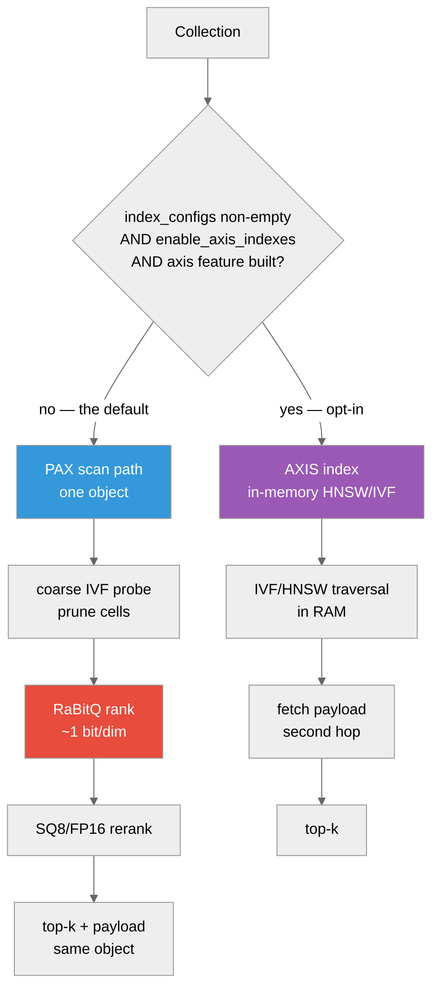

# Choosing a Vector Index: PAX IVF vs AXIS IVF

**And how to measure which one wins on *your* data**



The choice is made **per collection at create time**, not per query: AXIS serves
only a collection that declares a non-empty `index_configs`, on a server with
`storage.optimization.enable_axis_indexes = true`, in a binary built with the
Cargo `axis` feature. Anything else takes the PAX scan path
([ADR-070](https://github.com/anvai-labs/proximaDB/blob/main/docs/12-design/adr/ADR-070-axis-not-needed-for-codesign-collections.adoc)).

---

## Overview

ProximaDB ships **two** physical shapes for vector retrieval, and they are not
redundant — they optimise different cost terms.

| | **PAX IVF** (co-located) | **AXIS IVF** (separate index) |
|---|---|---|
| Where vectors live | In the data object, as typed stripes | In the data object |
| Where the index lives | *No separate index* — IVF coarse directory inside the segment footer | A separate in-memory HNSW/IVF structure; materialized projection bytes live under `indexes/<projection>/` |
| Payload fetch | Same object, same GET family | Second hop after the index returns ids |
| Quantization | RaBitQ (~1 bit/dim) → SQ8/FP16 rerank, in-segment | Index-side (IVF/HNSW/flat) |
| Filtered search | Metadata stripes co-resident → prune before ranking | Needs a join or post-filter |
| Default | **This is the default** (PAX + RaBitQ + row-group layout) | **Opt-in.** Needs non-empty `index_configs` *and* `storage.optimization.enable_axis_indexes = true`. The Cargo `axis` feature is in the default set, but that is compile-time *capability*, not activation (ADR-070, Accepted) |

The shapes map onto the industry split: PAX IVF is the "one object, many column
groups" model; AXIS IVF is the pgvector/LanceDB model where the index is a
separate artifact from the data. Note the difference from those systems, though:
AXIS's working structure is held **in RAM**, which is why ADR-070 measures its
cost as a "redundant second copy in RAM" (8.6 GB for 1M × 768d) rather than as
extra object-storage traffic. That memory is the price of its latency advantage.

## When to use which

**Prefer PAX IVF when:**

* **Queries carry predicates.** Metadata lives in the same object as the
  vectors, so a filtered ANN query prunes before ranking rather than paying a
  join or a post-filter. Measured on SIFT1M-100k over 8 partitions: filtered
  recall@10 **0.9907** against 0.9896 unfiltered — filtering did not cost
  recall. That comes from `sift_pax_filtered_cascade_recall_ratchet`
  (`tests/sift_pax_recall_ratchet_test.rs`, not `#[ignore]`d), and the qa-gate
  `sift-pax-recall` job logs it verbatim:
  `SIFT FILTERED cascade recall@10 = 0.9907 over 1000 queries (N=100000,
  floor=0.9, partitions=8)`.

  Two caveats, because the number is better than the contract. The ratchet
  **floor** is 0.90, not 0.99 — one run above it is not a guarantee. And
  per-collection filtered-ANN *policy* carries **no recall SLA**:
  `SUPPORTED_SURFACE.adoc` lists it as Not supported while ADR-011 is Beta, and
  that separate harness (`tests/filtered_ann_recall_bands.rs`) is `#[ignore]`d
  with floors of 0.30/0.60/0.80. So: a real measurement of the default policy,
  not a promise about a configurable one.
* **You need the payload with the hit.** Vector search returns ids; apps want
  records. Co-location keeps that in the same GET family rather than a second
  round trip.
* **Object storage is the substrate.** The cost model is round-trip-dominated,
  and one object means one footer, one coarse directory, one survivor fetch
  plan.

**Prefer AXIS IVF when:**

* **The corpus is static and the index is reused across many queries**, so a
  purpose-built traversal structure amortises its own storage.
* **You want index shapes PAX does not implement** (HNSW graph traversal, Annoy
  trees, flat exact) — see `src/index/axis/`.
* **The payload is large relative to the vector** and you do *not* want payload
  bytes anywhere near the ranking path.

To actually get AXIS you must do all three of these — any one missing silently
leaves you on the PAX path, which is the usual reason a reader concludes "I tried
AXIS and saw no difference":

1. create the collection with a non-empty `index_configs`;
2. run the server with `storage.optimization.enable_axis_indexes = true`
   (see `config/cloud-object-store.toml`);
3. build with the Cargo `axis` feature — it is in the default set, so this one
   is usually already true.

Budget the RAM: ADR-070 measures 8.6 GB for 1M × 768d vectors.

**A caution that applies to both.** Index choice is secondary to the
**I/O budget** (below). In our own measurements, moving the storage budget from
the local **1 MiB** target to the `s3://` **8 MiB** target cut GETs/query by 22%
at identical recall, while the IVF coalescing and nprobe knobs were *inert* on
the un-clustered path. Measure the budget first.

## The I/O budget dominates — and it is tunable

Per-backend defaults (`crates/storage/proximadb-storage-common/src/iops_budget.rs`):

| Backend | min | target | max |
|---|---|---|---|
| Azure (`az`/`azure`/`adls`/`abfs`) | 512 KiB | **4 MiB** | 4 MiB |
| S3 (`s3`/`http(s)`) | 512 KiB | **8 MiB** | 16 MiB |
| GCS (`gs`/`gcs`) | 512 KiB | **8 MiB** | 16 MiB |
| Local / MinIO | 256 KiB | 1 MiB | 8 MiB |
| Generic cloud | 512 KiB | 4 MiB | 8 MiB |
| Unknown | 512 KiB | 2 MiB | 8 MiB |

Three things worth knowing:

1. **Azure's 4 MiB is a conservative planner policy, not a platform limit.** The
   source says so explicitly: *"not a Blob billing quantum or a proven SDK range
   limit"* (tracked by TD-SEARCH-3). If you have wire evidence for your account,
   raise it.
2. **`PROXIMADB_DISK_CLASS=hdd` replaces the local profile with the cloud one**
   (4 MiB target), so a local measurement can silently change profile. Check it
   before comparing runs.
3. **You can override it per location**, which is the supported way to escape a
   default you have measured past:

```toml
[[storage.storage_locations]]
url = "az://mycontainer/vectors"
weight = 1
tags = ["vectors"]
  [storage.storage_locations.io_budget]
  target_bytes = 8388608     # 8 MiB — override the 4 MiB Azure default
  max_bytes    = 16777216    # 16 MiB
  # min_bytes and disk_class are optional; unset fields keep the profile value.
```

`IoBudgetConfig` is `deny_unknown_fields`, so the `_bytes` suffixes are not
optional spelling — `min`/`target`/`max` fail at startup with *"unknown field
`min`, expected one of `disk_class`, `min_bytes`, `target_bytes`, `max_bytes`"*.
`weight` and `tags` have no serde default either, so a location entry must carry
them. `config/multi-disk-config.toml` is a working reference.

Registered at boot and resolved by **longest matching URL prefix** (on `/`
boundaries), so you can tune one prefix without touching the rest.

## Benchmark it on your own dataset

The harness is `tests/sift_pax_recall_ratchet_test.rs`. It measures recall
against ground truth **and** the I/O cost in the same run, which is the point:
recall alone cannot tell you whether a configuration is affordable.

### Dataset format

Plain-binary TEXMEX `.fvecs` / `.ivecs` (little-endian, parsed with std only —
no HDF5 dependency):

| File | Shape | Purpose |
|---|---|---|
| `<dir>/sift_base.fvecs` | N × dim | the corpus to insert |
| `<dir>/sift_query.fvecs` | Q × dim | query set |
| `<dir>/sift_groundtruth.ivecs` | Q × 100 | true neighbours (optional) |

If ground truth is absent, or you insert a subset (`PROXIMADB_SIFT_N` below),
the harness computes a **brute-force oracle over the inserted rows** instead —
so your own corpus works without precomputed neighbours.

### Run it

!!! warning "This needs the repository, not a release"

    The harness is an integration test, so running it today requires a git
    checkout, the pinned Rust toolchain and `cargo test` — it is **not** in any
    released artifact, and there is no `proximadb`-CLI equivalent yet.
    **TD-VECEVAL-1** tracks shipping it as a subcommand of
    `apps/proximadb-ann-bench` so it can be run against your own data without
    building the server. Until then, treat this section as instructions for
    someone working in the repo.

```bash
PROXIMADB_SIFT_DATASET_DIR=/path/to/your/vectors \
PROXIMADB_SIFT_N=100000 \
PROXIMADB_SIFT_QUERIES=1000 \
PROXIMADB_RECALL_DATASET_REQUIRED=1 \
  cargo test --release --features io-trace \
    --test sift_pax_recall_ratchet_test -- --nocapture
```

Add `,aws` to `--features` and set `PROXIMADB_OBJECT_STORE_URL=s3://bucket/prefix`
(plus `AWS_ENDPOINT`/credentials) to measure under a **cloud** I/O budget rather
than the local one. Without this you are measuring the 1 MiB-target local profile,
which understates the GET savings a cloud budget gives you.

### Knobs

| Env | Effect |
|---|---|
| `PROXIMADB_SIFT_DATASET_DIR` | corpus dir (**unset → test skips**) |
| `PROXIMADB_SIFT_N` | insert only the first N base vectors |
| `PROXIMADB_SIFT_QUERIES` | query count (default 1000) |
| `PROXIMADB_SIFT_RECALL_FLOOR` | fail below this recall@10 (default 0.90) |
| `PROXIMADB_RECALL_DATASET_REQUIRED` | fail instead of skip when the corpus is missing |
| `PROXIMADB_OBJECT_STORE_URL` | measure against a cloud/emulator base |
| `PROXIMADB_SIFT_COALESCED_BYTE_BUDGET` | fail above this bytes/query |
| `PROXIMADB_COUNT_FS_IO=1` | process-global GET/byte counters |
| `PROXIMADB_PAX_READ_COARSE_NPROBE` | coarse cells probed (recall↔GET trade) |
| `PROXIMADB_PAX_BLOCK_CLUSTER=1` + `PROXIMADB_PAX_FLUSH_CLUSTER=ivf` | train the IVF coarse directory at flush |

### Reading the output

Verbatim from the qa-gate `sift-pax-recall` job — two long lines, not wrapped:

```
SIFT PAX cascade recall@10 [rg_layout] = 0.9896 over 1000 queries (N=100000, floor=0.9, brute-force-GT rows=396)
SIFT paired exact/ANN evidence: pairs=30, N=100000, dim=128, top_k=10; exact p50/p95=165042/166467 us, ANN p50/p95=25798/28831 us; exact GET/range-GET/bytes/compute-ms per pair=5.00/0.00/74961193/164.57, ANN GET/range-GET/bytes/compute-ms per pair=53.97/53.97/25297445/25.47
```

`brute-force-GT rows=396` means ground truth for 396 of the 1000 queries came
from the brute-force oracle rather than the provided file — expected when you
insert a subset.

Note `pairs=30`. Recall is measured over all 1000 queries, but the paired I/O
and compute figures come from a 30-pair sample at N=100k (300 pairs at N=10k,
3 at N=1M). Do not read the I/O columns as 1000-query averages.

Four numbers decide a configuration, and you want them **together**:

* **recall@10** — is it still correct?
* **GETs/query** — the round-trip (DEPTH) term; dominant on object storage.
* **bytes/query** — the egress (BYTES) term.
* **bytes/GET** (derived) — tells you whether your budget is sized right. Far
  below `target` means you are paying round-trips for small reads.

## Reference measurements

SIFT1M subset, N=100 000, dim 128, top_k 10, recall over 1000 queries, I/O over
30 pairs, RaBitQ→SQ8 cascade with the row-group layout.

**Provenance, because it changes how much weight these carry:**

* Rows 1–2 are from the **qa-gate `sift-pax-recall` job**, the last successful
  run (2026-09-04). They are reproducible in CI.
* Row 3 is **workstation-only and not in the evidence ledger** — no CI job sets
  `PROXIMADB_OBJECT_STORE_URL`, so the `s3://` budget arm has never run in CI.
  Treat it as indicative, and re-measure on your own account before relying on
  it. (That gap is part of what TD-VECEVAL-1 covers.)
* The harness forces `PROXIMADB_PAX_F32_TIER=1`, which is **default-OFF**
  (`ENV_GATE_REGISTRY.adoc`) and changes which stripes a segment emits. So the
  three ANN rows are *default + one opt-in gate*, not stock defaults — and that
  gate moves the very bytes/query and bytes/GET columns below.
* The **filtered** figure quoted earlier has a different provenance again: that
  arm additionally forces `PROXIMADB_PAX_FOOTER_STATS=1` (also default-OFF) and
  sets `PROXIMADB_PAX_WRITE_RG_LAYOUT=0`, i.e. it turns *off* the shipped default
  this table shows to be the largest win. It is therefore *default + two opt-in
  gates − one default*. Its comparison is still apples-to-apples — the
  matching-geometry `[baseline]` arm in the same run is 0.9896 — but it is not
  the configuration of rows 3–4.

| Configuration | recall@10 | GETs/query | bytes/query | bytes/GET | Source |
|---|---|---|---|---|---|
| Exact scan (no ANN) | 1.0 by definition | **5.00** | 75.0 MB | 15.0 MB | CI |
| ANN, no row-group layout (`[baseline]`) | 0.9896 | 70.43 | 97.8 MB | ~1.4 MB | CI |
| ANN, row-group layout (`[rg_layout]`) | 0.9896 | 53.97 | 25.3 MB | ~469 KB | CI |
| **ANN, `s3://` budget (8 MiB target)** | 0.9896 | **42.03** | 26.9 MB | ~639 KB | workstation |

Rows 2–4 are the same ANN configuration differing only in layout and budget, and
rows 2–3 come from **one** qa-gate run (both arms logged in it), so the layout
comparison is as controlled as this harness gets.

Reading it:

* ANN buys **−66% bytes** and **−85% compute** over an exact scan (164.57 ms →
  25.47 ms in that run), but costs **~8–11× more round-trips**. Note the scope:
  that compares row 1 to **row 3**, both from the `[rg_layout]` arm. Without the
  row-group layout the trade is *worse than nothing* on bytes — the `[baseline]`
  arm's own exact leg was 78.2 MB against its ANN 97.8 MB, so comparing rows 1
  and 2 across arms is not meaningful. On object storage
  that trade is the whole decision, and it is why the budget matters more than
  the knobs.
* The **row-group layout alone cuts ANN GETs 70.43 → 53.97 (−23%) and bytes
  97.8 → 25.3 MB (−74%) at identical recall 0.9896** — the largest single effect
  in the table, and it is a shipped default rather than a knob.
* Moving from the **local 1 MiB target to the `s3://` 8 MiB target cut GETs 22%
  for +6% bytes at identical recall** — a
  straight DEPTH-for-BYTES win, and the clearest tunable lever we measured.
* With the IVF coarse directory **trained**, the ledgered 1M-scale sweep records
  **81 GETs / 92 ms probed vs 108 GETs / 144 ms unprobed** at recall
  0.9860–0.9870 (ratchet 0.984) — better on every axis. Untrained, nprobe does
  nothing, which is the trap: train before you tune.

## Caveats

* Everything above is **measured on one corpus** (SIFT1M, dim 128, L2). Your
  dimensionality, clustering and filter selectivity will move these numbers —
  which is exactly why the harness takes your dataset.
* Latency under `PROXIMADB_OBJECT_STORE_URL` against a local emulator includes
  HTTP overhead and is **not** comparable to the local-filesystem latency
  column. Compare GETs and bytes across backends; compare latency only within
  one backend.
* `sift_ivf2_coarse_probe_recall_ratchet` currently fails a precondition
  (it passes a collection *name* where a catalog object id is required). It is
  `#[ignore]`d, so CI does not catch the drift. Use
  `sift_ivf2_probe_release_bakeoff_eval` (which is `#[ignore]`d, so it needs
  `-- --ignored`) for the clustered arm until that is
  fixed.

## See also

* `docs/12-design/RABITQ_PAX_SEGMENT_MIGRATION_PLAN_2026_06.adoc` — the cascade's phased rollout
* `docs/12-design/VECTOR_LAKEBASE_ALIGNMENT_2026_05_28.adoc` — the separation/lakehouse trade-offs
* `crates/storage/proximadb-storage-common/src/iops_budget.rs` — budget resolution order
* `.github/workflows/qa-gate.yml` job `sift-pax-recall` — how CI runs this
