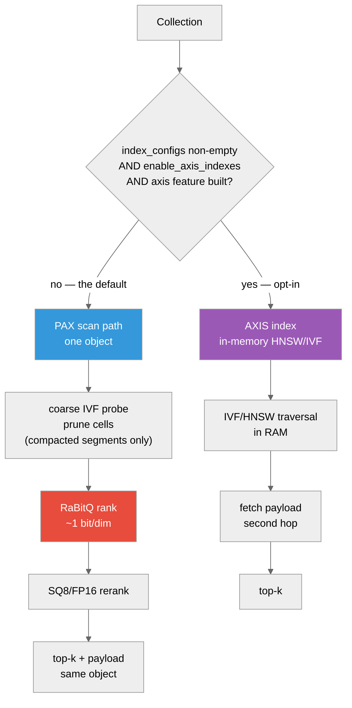

# Choosing a Vector Index: PAX IVF vs AXIS IVF

**And how to measure which one wins on *your* data**



The choice is made **per collection at create time**, not per query: AXIS serves
only a collection that declares a non-empty `index_configs`, on a server with
`storage.optimization.enable_axis_indexes = true`, in a binary built with the
Cargo `axis` feature. Anything else takes the PAX scan path
([ADR-070](https://github.com/anvai-labs/proximaDB/blob/main/docs/12-design/adr/ADR-070-axis-not-needed-for-codesign-collections.adoc)).

---

## Overview

ProximaDB ships **two** physical shapes for vector retrieval, and they are not
redundant — they optimise different cost terms.

| | **PAX IVF** (co-located) | **AXIS IVF** (separate index) |
|---|---|---|
| Where vectors live | In the data object, as typed stripes | In the data object |
| Where the index lives | *No separate index* — the IVF coarse directory is **Region A0**, inside the same object (written by compaction only; a freshly flushed segment has none — see *Knobs*) | A separate in-memory HNSW/IVF structure; materialized projection bytes live under `indexes/<projection>/` |
| Payload fetch | Same object, same GET family | Second hop after the index returns ids |
| Quantization | RaBitQ (~1 bit/dim) → SQ8/FP16 rerank, in-segment | Index-side (IVF/HNSW/flat) |
| Filtered search | Metadata stripes co-resident → prune before ranking | Needs a join or post-filter |
| Default | **This is the default** (PAX + RaBitQ + row-group layout) | **Opt-in.** Needs non-empty `index_configs` *and* `storage.optimization.enable_axis_indexes = true`. The Cargo `axis` feature is in the default set, but that is compile-time *capability*, not activation (ADR-070, Accepted) |

The shapes map onto the industry split: PAX IVF is the "one object, many column
groups" model; AXIS IVF is the pgvector/LanceDB model where the index is a
separate artifact from the data. Note the difference from those systems, though:
AXIS's working structure is held **in RAM**, which is why ADR-070 measures its
cost as a "redundant second copy in RAM" (8.6 GB for 1M × 768d) rather than as
extra object-storage traffic. That memory is the price of its latency advantage.

## When to use which

**Prefer PAX IVF when:**

* **Queries carry predicates.** Metadata lives in the same object as the
  vectors, so a filtered ANN query prunes before ranking rather than paying a
  join or a post-filter. Measured on SIFT1M-100k over 8 partitions: filtered
  recall@10 **0.9907** against 0.9896 unfiltered — filtering did not cost
  recall. That comes from `sift_pax_filtered_cascade_recall_ratchet`
  (`tests/sift_pax_recall_ratchet_test.rs`, not `#[ignore]`d), and the qa-gate
  `sift-pax-recall` job logs it verbatim:
  `SIFT FILTERED cascade recall@10 = 0.9907 over 1000 queries (N=100000,
  floor=0.9, partitions=8)`.

  Two caveats, because the number is better than the contract. The ratchet
  **floor** is 0.90, not 0.99 — one run above it is not a guarantee. And
  per-collection filtered-ANN *policy* carries **no recall SLA**:
  `SUPPORTED_SURFACE.adoc` lists it as Not supported while ADR-011 is Beta, and
  that separate harness (`tests/filtered_ann_recall_bands.rs`) is `#[ignore]`d
  with floors of 0.30/0.60/0.80. So: a real measurement of the default policy,
  not a promise about a configurable one.
* **You need the payload with the hit.** Vector search returns ids; apps want
  records. Co-location keeps that in the same GET family rather than a second
  round trip.
* **Object storage is the substrate.** The cost model is round-trip-dominated,
  and one object means one footer, one coarse directory, one survivor fetch
  plan.

**Prefer AXIS IVF when:**

* **The corpus is static and the index is reused across many queries**, so a
  purpose-built traversal structure amortises its own storage.
* **You want index shapes PAX does not implement** (HNSW graph traversal, Annoy
  trees, flat exact) — see `src/index/axis/`.
* **The payload is large relative to the vector** and you do *not* want payload
  bytes anywhere near the ranking path.

To actually get AXIS you must do all three of these — any one missing silently
leaves you on the PAX path, which is the usual reason a reader concludes "I tried
AXIS and saw no difference":

1. create the collection with a non-empty `index_configs`;
2. run the server with `storage.optimization.enable_axis_indexes = true`
   (`config/cloud-object-store.toml` is where the key lives, but note it ships
   `= false` — that file shows you the path, not the value you want);
3. build with the Cargo `axis` feature — it is in the default set, so this one
   is usually already true.

Budget the RAM: ADR-070 measures 8.6 GB for 1M × 768d vectors.

**A caution that applies to both.** Index choice is secondary to the
**I/O budget** (below). In our own measurements, moving the storage budget from
the local **1 MiB** target to the `s3://` **8 MiB** target cut GETs/query by 22%
at identical recall, while the nprobe knob was *inert* on the un-clustered path
(no Region A0 to probe — see *Knobs*). Measure the budget first.

Read that 22% with the same caution the reference table carries: the two sides
come from **different machines** (CI for the local budget, a workstation for
`s3://`), so it is an indication of direction and rough size, not a within-run
measurement. The GET and byte deltas are the reproducible part; treat latency
across those two rows as not comparable at all.

## The I/O budget dominates — and it is tunable

Per-backend defaults (`crates/storage/proximadb-storage-common/src/iops_budget.rs`):

| Backend | min | target | max |
|---|---|---|---|
| Azure (`az`/`azure`/`adls`/`abfs`) | 512 KiB | **4 MiB** | 4 MiB |
| S3 (`s3`/`http(s)`) | 512 KiB | **8 MiB** | 16 MiB |
| GCS (`gs`/`gcs`) | 512 KiB | **8 MiB** | 16 MiB |
| Local / MinIO | 256 KiB | 1 MiB | 8 MiB |
| Generic cloud | 512 KiB | 4 MiB | 8 MiB |
| Unknown | 512 KiB | 2 MiB | 8 MiB |

Three things worth knowing:

1. **Azure's 4 MiB is a conservative planner policy, not a platform limit.** The
   source says so explicitly: *"not a Blob billing quantum or a proven SDK range
   limit"* (tracked by TD-SEARCH-3). If you have wire evidence for your account,
   raise it.
2. **`PROXIMADB_DISK_CLASS=hdd` replaces the local profile with the cloud one**
   (4 MiB target), so a local measurement can silently change profile. Check it
   before comparing runs.
3. **You can override it per location**, which is the supported way to escape a
   default you have measured past:

```toml
[[storage.storage_locations]]
url = "az://mycontainer/vectors"
weight = 1
tags = ["vectors"]
  [storage.storage_locations.io_budget]
  target_bytes = 8388608     # 8 MiB — override the 4 MiB Azure default
  max_bytes    = 16777216    # 16 MiB
  # min_bytes and disk_class are optional; unset fields keep the profile value.
```

`IoBudgetConfig` is `deny_unknown_fields`, so the `_bytes` suffixes are not
optional spelling — `min`/`target`/`max` fail at startup with *"unknown field
`min`, expected one of `disk_class`, `min_bytes`, `target_bytes`, `max_bytes`"*.
`weight` and `tags` have no serde default either, so a location entry must carry
them. `config/multi-disk-config.toml` is a working reference.

Registered at boot and resolved by **longest matching URL prefix** (on `/`
boundaries), so you can tune one prefix without touching the rest.

## Benchmark it on your own dataset

The harness is `tests/sift_pax_recall_ratchet_test.rs`. It measures recall
against ground truth **and** the I/O cost in the same run, which is the point:
recall alone cannot tell you whether a configuration is affordable.

### Dataset format

Plain-binary TEXMEX `.fvecs` / `.ivecs` (little-endian, parsed with std only —
no HDF5 dependency):

| File | Shape | Purpose |
|---|---|---|
| `<dir>/sift_base.fvecs` | N × dim | the corpus to insert |
| `<dir>/sift_query.fvecs` | Q × dim | query set |
| `<dir>/sift_groundtruth.ivecs` | Q × 100 | true neighbours (optional) |

If ground truth is absent, or you insert a subset (`PROXIMADB_SIFT_N` below),
the harness computes a **brute-force oracle over the inserted rows** instead —
so your own corpus works without precomputed neighbours.

### Run it

!!! warning "This needs the repository, not a release"

    The harness is an integration test, so running it today requires a git
    checkout, the pinned Rust toolchain, and — unless you use plain `cargo
    test`, which is also safe inside this checkout (see below) —
    **`cargo-nextest`** (`make install-fast-tools`, or `cargo install
    cargo-nextest --locked`; it is not in the pinned toolchain, so a fresh
    checkout gets `error: no such command: nextest` without it). It is **not** in any released artifact, and
    there is no `proximadb`-CLI equivalent yet.
    **TD-VECEVAL-1** tracks shipping it as a subcommand of
    `apps/proximadb-ann-bench` so it can be run against your own data without
    building the server. Until then, treat this section as instructions for
    someone working in the repo.

```bash
PROXIMADB_SIFT_DATASET_DIR=/path/to/your/vectors \
PROXIMADB_SIFT_N=100000 \
PROXIMADB_SIFT_QUERIES=1000 \
  cargo nextest run --release --features io-trace \
    --test sift_pax_recall_ratchet_test --no-capture
```

Use **nextest** (the repo's determinism-and-test-hygiene mandate, `docs/agent-rules/CLAUDE.md.seed` #11). Three of the arms set process-global PAX env vars
(`PROXIMADB_PAX_WRITE_RG_LAYOUT`, `PROXIMADB_PAX_FOOTER_STATS`) with no mutex, so
they must not run concurrently; nextest gives each test its own process, which
makes that structural.

Inside this checkout a plain `cargo test` is also safe, for a reason worth
knowing: `.cargo/config.toml` sets `[env] RUST_TEST_THREADS = "1"`, so libtest
already runs one test at a time here, and the arms each set their own gates
before writing. That is how the **CI** rows in the table above were produced —
the qa-gate job runs `cargo test`, and it has always been serial.

The reason to prefer nextest anyway is that neither protection travels. Cargo's
`[env]` without `force = true` does **not** override an externally exported
`RUST_TEST_THREADS`, and `.cargo/config.toml` only applies when you build from
this directory tree — so a wrapper, a CI runner, or a copy of the test outside
the repo can reintroduce parallelism silently. Nextest ignores
`RUST_TEST_THREADS` entirely (that file says so) and isolates by process
regardless.

Do **not** add `PROXIMADB_RECALL_DATASET_REQUIRED=1` here. It exists so CI fails
loudly instead of skipping, and it asserts that **all three** files are present —
including `sift_groundtruth.ivecs`, which is otherwise optional. Set it only when
you have the full TEXMEX set and want a missing corpus to be an error.

Add `,aws` to `--features` and set `PROXIMADB_OBJECT_STORE_URL=s3://bucket/prefix`
(plus `AWS_ENDPOINT`/credentials) to measure under a **cloud** I/O budget rather
than the local one. Without this you are measuring the 1 MiB-target local profile,
which understates the GET savings a cloud budget gives you.

### Knobs

| Env | Effect |
|---|---|
| `PROXIMADB_SIFT_DATASET_DIR` | corpus dir (**unset → test skips**) |
| `PROXIMADB_SIFT_N` | insert only the first N base vectors |
| `PROXIMADB_SIFT_QUERIES` | query count — default **1000** for the two cascade arms, **100** for the filtered arm, which carries its own default |
| `PROXIMADB_SIFT_RECALL_FLOOR` | fail below this recall@10 (default 0.90) |
| `PROXIMADB_RECALL_DATASET_REQUIRED` | fail instead of skip when the corpus is missing |
| `PROXIMADB_OBJECT_STORE_URL` | measure against a cloud/emulator base |
| `PROXIMADB_PAX_READ_COARSE_NPROBE` | coarse cells probed (recall↔GET trade) — **requires a compacted segment**, see below |
| `PROXIMADB_SEGMENT_INVARIANTS_CACHE_MB` | **leave unset.** Unset keeps the cache-free baseline the CI rows were measured under; any value opts the run into the corresponding route-time cache policy, which changes both the numbers and the cohort they are reported under (`cache_policy` is part of the cohort key, so its identity changes; admission itself is not narrowed) |
| `PROXIMADB_SURVIVOR_CACHE_BUDGET_MB` | **leave unset**, same reason |

The table above is the set worth *knowing about* for this run — two of its rows
exist to say leave them alone — and not an
exhaustive list of what the file reads (it also consults the `PROXIMADB_SIFT_IVF2_*`
family, `PROXIMADB_SIFT_IVF_FLUSH`, `PROXIMADB_IVF_K`,
`PROXIMADB_TRAINING_COMPACTION_MIN_MB`, `PROXIMADB_TRACE_GETS` and others, which
belong to the `#[ignore]`d arms). Two of them are worth calling out because they
look like they belong in the documented run and do not:

* `PROXIMADB_SIFT_COALESCED_BYTE_BUDGET` (bytes/query ceiling) is **inert here** —
  it is read only inside the `#[ignore]`d `sift_coalesced_rabitq_scan_rerank_eval`,
  which needs `-- --ignored`.
* `PROXIMADB_COUNT_FS_IO` is **not inert — do not set it.** It is read by
  *production* code, not the test: the filesystem factory wraps every filesystem
  in `CountingFileSystem` when it is present. The check is
  `var_os(...).is_some()`, so **even `PROXIMADB_COUNT_FS_IO=0` turns the wrapper
  on** and changes the stack your latency numbers come from. The two `#[ignore]`d
  evals that measure filesystem counters — `sift_coalesced_rabitq_scan_rerank_eval`
  and `sift_ivf2_coarse_probe_recall_ratchet` — set it for themselves
  deliberately (the bakeoff eval does not set it at all); the documented run must
  not, and it does not need to — it derives GET and byte figures from io_trace snapshots,
  which is why it needs `--features io-trace`.

!!! warning "nprobe is inert in the documented run, and no env var fixes that"

    `PROXIMADB_PAX_READ_COARSE_NPROBE` probes **Region A0**, and
    **compaction is the only write path that emits A0**: the flush entry point
    passes `None` for the probe plan (`segment_format.rs` — *"two-level is
    compaction-only (TD-RDSTRAT-8)"*), because IVF-at-flush measured **~80×
    flush cost** and was dropped. Training is already default-ON
    (`PROXIMADB_PAX_WRITE_A0_TRAIN`), so **no env var makes flush emit A0** — no
    knob substitutes for a compaction having run. (`PROXIMADB_PAX_FLUSH_CLUSTER=ivf`
    does apply a compaction-grade PCA+IVF recluster at flush, which is why that
    phrasing matters: it changes record *ordering*, while the probe plan handed to
    the flush writer is still `None`, so there is no Region A0 either way.)

    **Why the run above produces no A0 is worth stating precisely, because it is
    not "flush declined to".** The durable fact is that *these ratchet
    collections do not compact*, so no A0 is ever written for nprobe to read.
    *How* they come not to compact changed deliberately, and both halves are
    worth knowing because the second only reads as an improvement given the
    first:

    * **Between TD-WLP-7 and TD-SIFTCOMPACT-1** — that is, from #1012
      (2026-07-15), which first wired flush to compaction at all; before it the
      post-flush hook was a stub and nothing scheduled compaction from a flush —
      compaction was armed by default, and at
      `PROXIMADB_SIFT_N=100000` with a 20 000-row batch the fifth flush crossed
      the L0 threshold of 5 — so compaction became *due*, was attempted, and
      failed admission because the collection id is a name
      (`sift_pax_ratchet_baseline`) where the boundary requires a decimal catalog
      object id. The error was recorded on the flush result, logged at `warn`,
      and the flush succeeded, so nothing surfaced it. The arms were measuring a
      layout nothing had chosen.
    * **TD-SIFTCOMPACT-1 pins these collections `compaction:off`**, which makes
      the same conclusion *structural* rather than an accident of a swallowed
      error — and makes the three CI-carried arms deterministic.

    Either way nprobe is inert **in the documented run above** — the three
    non-`#[ignore]`d arms — so it measures byte-identical there however you set
    it. **TD-SIFTCOMPACT-1** and **TD-VECEVAL-1** carry the detail.

    To exercise nprobe you need a compacted segment, which means a different
    test in the same file:

    * `sift_ivf2_coarse_probe_recall_ratchet` is the **worked example**. It
      drives compaction through the *production* flush trigger — it mints a real
      catalog object id so admission succeeds, and awaits compaction quiescence
      before measuring — then compares probe ON against the whole-region scan
      over that segment. `#[ignore]`d, so it needs `-- --ignored`.
    * `sift_ivf2_probe_release_bakeoff_eval` (also `#[ignore]`d) is the
      writer-direct alternative: it calls the compacted writer itself rather than
      going through the flush trigger. **It is not a general substitute** — it
      hard-asserts a full 1 000 000-row corpus and exactly 100 queries and
      requires `sift_groundtruth.ivecs`, and it reads neither
      `PROXIMADB_SIFT_N` nor `PROXIMADB_SIFT_QUERIES`, so on your own corpus it
      panics rather than scaling down. Use it only against complete SIFT1M.

### Reading the output

Verbatim from the qa-gate `sift-pax-recall` job — two long lines, not wrapped:

```
SIFT PAX cascade recall@10 [rg_layout] = 0.9896 over 1000 queries (N=100000, floor=0.9, brute-force-GT rows=396)
SIFT paired exact/ANN evidence: pairs=30, N=100000, dim=128, top_k=10; exact p50/p95=165042/166467 us, ANN p50/p95=25798/28831 us; exact GET/range-GET/bytes/compute-ms per pair=5.00/0.00/74961193/164.57, ANN GET/range-GET/bytes/compute-ms per pair=53.97/53.97/25297445/25.47
```

`brute-force-GT rows=396` means ground truth for 396 of the 1000 queries came
from the brute-force oracle rather than the provided file — expected when you
insert a subset.

Note `pairs=30`. Recall is measured over all 1000 queries, but the paired I/O
and compute figures come from a 30-pair sample at N=100k (300 pairs at N=10k with the default 1000 queries (the ci.yml job sets 100 queries, so 100 pairs there — which is the figure the test file's own comment quotes, scoped to CI without saying so),
3 at N=1M). Do not read the I/O columns as 1000-query averages.

Four numbers decide a configuration, and you want them **together**:

* **recall@10** — is it still correct?
* **GETs/query** — the round-trip (DEPTH) term; dominant on object storage.
* **bytes/query** — the egress (BYTES) term.
* **bytes/GET** (derived) — tells you whether your budget is sized right. Far
  below `target` means you are paying round-trips for small reads.

## Reference measurements

SIFT1M subset, N=100 000, dim 128, top_k 10, recall over 1000 queries, I/O over
30 pairs, RaBitQ→SQ8 cascade with the row-group layout.

**Provenance, because it changes how much weight these carry:**

Rows are referenced by **label**, not by index — an earlier revision numbered
them, then a row was inserted and the numbering silently desynchronised from the
table's own `Source` column.

* **No row in this table is in the evidence ledger.** Every GET and byte figure
  below is read off a run that was not recorded — a **job log** for the three
  qa-gate rows, a workstation console for the `s3://` row — and none of them
  appears in `BENCHMARK_EVIDENCE.toml`. Nor is there a ledgered I/O figure for
  *this* configuration to check them against: the ledger claim backing these
  cascade arms, `pax_rabitq_sq8_sift1m_recall_at_10`, is recall-only
  (`metric = "recall_at_10"`, TD-SIFTCOMPACT-1). The ledger does carry SIFT I/O
  claims — `rdstrat8_sift_ivf2_coarse_probe` and `nprobe_sweep_trained_1m`, both
  discussed later in this section — but those are different runs on different beds
  and hardware, so they are not a baseline for these rows. Per engineering mandate #6
  that makes the figures here *reproducible* but not *ledgered*: cite them as
  such, and land a ledger entry before quoting them as end-to-end evidence in an
  ADR or a release claim.
* **Exact scan**, **`[baseline]`** and **`[rg_layout]`** all come from one
  **qa-gate `sift-pax-recall`** run — the last successful one, 2026-09-04 — and
  are reproducible in CI. `[baseline]` and `[rg_layout]` are both logged in that
  single run, which is what makes the layout comparison controlled.
* **`s3://` budget** is **workstation-only** — no CI job sets
  `PROXIMADB_OBJECT_STORE_URL`, so that arm has never run in CI.
  Treat it as indicative and re-measure on your own account. (That gap is part of
  what TD-VECEVAL-1 covers.)
* The harness forces `PROXIMADB_PAX_F32_TIER=1`, which is **default-OFF**
  (`ENV_GATE_REGISTRY.adoc`) and changes which stripes a segment emits — so no
  row here is stock defaults, and that gate moves the very bytes/query and
  bytes/GET columns. Note also that **`[baseline]` additionally sets
  `PROXIMADB_PAX_WRITE_RG_LAYOUT=0`**, disabling a shipped default; that is the
  point of the row, and its label says so.
* The **filtered** figure quoted earlier has a different provenance again: that
  arm additionally forces `PROXIMADB_PAX_FOOTER_STATS=1` (also default-OFF) and
  sets `PROXIMADB_PAX_WRITE_RG_LAYOUT=0`, i.e. it turns *off* the shipped default
  this table shows to be the largest win. It is therefore *default + two opt-in
  gates − one default*. Its comparison is still apples-to-apples — the
  matching-geometry `[baseline]` arm in the same run is 0.9896 — but it is not
  the configuration of the `[rg_layout]` or `s3://` rows.

| Configuration | recall@10 | GETs/query | bytes/query | bytes/GET | Source |
|---|---|---|---|---|---|
| Exact scan (no ANN) | 1.0 by definition | **5.00** | 75.0 MB | 15.0 MB | CI |
| ANN, no row-group layout (`[baseline]`) | 0.9896 | 70.43 | 97.8 MB | ~1.4 MB | CI |
| ANN, row-group layout (`[rg_layout]`) | 0.9896 | 53.97 | 25.3 MB | ~469 KB | CI |
| **ANN, `s3://` budget (8 MiB target)** | 0.9896 | **42.03** | 26.9 MB | ~639 KB | workstation |

The three ANN rows are the same configuration differing only in layout and
budget, and the two CI ones come from **one** qa-gate run, so the layout
comparison is as controlled as this harness gets.

Reading it:

* ANN buys **−66% bytes** and **−85% compute** over an exact scan (164.57 ms →
  25.47 ms in that run), but costs **~11× more round-trips** — 53.97/5.00 =
  10.8×, comparing row 1 to **row 3**, both from the `[rg_layout]` arm and the
  same CI run. (An earlier revision quoted "~8–11×", whose lower end was row 4 ÷
  row 1 = 8.4×. That ratio is deliberately **not** published here: row 4 is a
  workstation run under the `s3://` 8 MiB budget while row 1 is CI under the local
  1 MiB budget, and the exact leg was never measured under the s3 budget — so it
  divides across both provenance and budget, which is the comparison this bullet
  warns against two sentences on.) Without the
  row-group layout the trade is *worse than nothing* on bytes — the `[baseline]`
  arm's own exact leg was 78.2 MB against its ANN 97.8 MB, so comparing rows 1
  and 2 across arms is not meaningful. On object storage
  that trade is the whole decision, and it is why the budget matters more than
  the knobs.
* The **row-group layout alone cuts ANN GETs 70.43 → 53.97 (−23%) and bytes
  97.8 → 25.3 MB (−74%) at identical recall 0.9896** — the largest single effect
  in the table, and it is a shipped default rather than a knob.
* Moving from the **local 1 MiB target to the `s3://` 8 MiB target cut GETs 22%
  for +6% bytes at identical recall** — a straight DEPTH-for-BYTES win, and the
  largest *GET* reduction available from configuration rather than from a format
  change. Note it is **not** the largest effect in the table: the row-group
  layout above beats it on both axes (−23.4% GETs and −74.1% bytes, against
  −22.1% GETs for **+6.3%** bytes), and does so within one run. An earlier
  revision called this "the largest effect of any knob we turned", which was
  compatible with that because the layout is a shipped default rather than a
  knob; dropping the knob scoping removed the only thing keeping the two
  superlatives apart. **Same caveat as the withheld 8.4× above**, and
  stated here rather than only there because this is the figure a reader is most
  likely to act on.

  Be precise about what varies, because an earlier revision claimed "only the
  budget differs" and that is false: row 3 is CI under the local 1 MiB budget and
  row 4 is a workstation under the `s3://` 8 MiB budget, so this crosses the
  machine, the budget **and the storage backend** — local-filesystem reads versus
  HTTP ranged GETs, the same confound the Caveats section names for latency.
  Budget cannot in fact be varied alone this way: `IopsBudget::for_path` consults
  any registered per-location budget first and otherwise resolves by scheme (via
  `for_scheme_and_env`, which is also where `PROXIMADB_DISK_CLASS` applies), so
  isolating the budget needs the per-location `io_budget` override
  documented above, which this arm did not use. It is also not reached "by turning
  a knob" — it is reached by changing the store URL.

  It is published where 8.4× is not for one narrower reason: the 22% holds the
  *leg* constant, ANN on both sides, whereas 8.4× compares an exact leg against an
  ANN leg and so carries one confound more. Treat it as a direction, not a number,
  until both rows are re-measured on one machine against one backend.
* With the IVF coarse directory **trained**, the ledgered 1M-scale sweep
  (`nprobe_sweep_trained_1m`) records
  **81 GETs / 92 ms at recall 0.9860 probed vs 108 GETs / 144 ms at 0.9840
  unprobed** (ratchet 0.984) — better on every axis, recall included, **on the
  1M bed**. (The ledger's 0.9870 is the nprobe=12 arm, which is not the
  comparison above; quoting it as the top of a band was wrong.)

  The sign flips below that scale, which matters because it is the scale the run
  command above targets. TD-IVF2ENGAGE-1 measures the probe's recall *below*
  unprobed at every scale it ran — 0.9880 vs 0.9905 at 20k, 0.9800 vs 0.9820 at
  100k, 0.9800 vs 0.9845 at 333k — and the ledger's own
  `rdstrat8_sift_ivf2_coarse_probe` entry records GETs/query going **up** 13 → 22
  at 100k. So "better on every axis" is a 1M-bed result, not a general one: at
  your likely scale expect to trade a little recall and possibly more round trips
  for fewer bytes, and measure rather than assume. On an **uncompacted**
  segment there is no Region A0 to probe, so nprobe does nothing: that is the
  trap, and no env var substitutes for a compaction having run (training is
  already default-ON, and flush deliberately never emits A0). The admonition
  under *Knobs* explains why the documented run never compacts, and which test to
  use when you want the probed arm.

## Caveats

* Everything above is **measured on one corpus** (SIFT1M, dim 128, L2). Your
  dimensionality, clustering and filter selectivity will move these numbers —
  which is exactly why the harness takes your dataset.
* Latency under `PROXIMADB_OBJECT_STORE_URL` against a local emulator includes
  HTTP overhead and is **not** comparable to local-filesystem latency. The
  reference table deliberately has no latency column for that reason — compare
  GETs and bytes across backends, and compare latency only within one backend,
  using the `compute-ms` figures in the raw output rather than the table.
* The probed arms — `sift_ivf2_coarse_probe_recall_ratchet` and
  `sift_ivf2_probe_release_bakeoff_eval`, both described under *Knobs* — are
  `#[ignore]`d, so **no CI tier runs either** (the ci.yml and qa-gate invocations
  both omit `--ignored`) and drift in them surfaces only when someone runs them
  by hand. **TD-IVF2ENGAGE-1** records what the *coarse-probe* arm currently
  measures — it says nothing about the bakeoff eval — including a
  retraction worth reading: an earlier "the probe barely engages" finding (1.7%
  of queries at N=100k) was an un-awaited background compaction in the harness,
  not a product effect — re-measured behind a barrier it is 1000/1000. Note what
  the retraction does **not** cover: that TD was *retitled* around a
  scale-dependent effect which survived — fetch-round depth growing with corpus
  size — so not every "at scale" finding there is withdrawn.

## See also

* `docs/12-design/RABITQ_PAX_SEGMENT_MIGRATION_PLAN_2026_06.adoc` — the cascade's phased rollout
* `docs/12-design/VECTOR_LAKEBASE_ALIGNMENT_2026_05_28.adoc` — the separation/lakehouse trade-offs
* `crates/storage/proximadb-storage-common/src/iops_budget.rs` — budget resolution order
* `.github/workflows/ci.yml` (LIGHT tier, N=10 000) and
  `.github/workflows/qa-gate.yml` job `sift-pax-recall` (N=100 000) — how CI runs this
