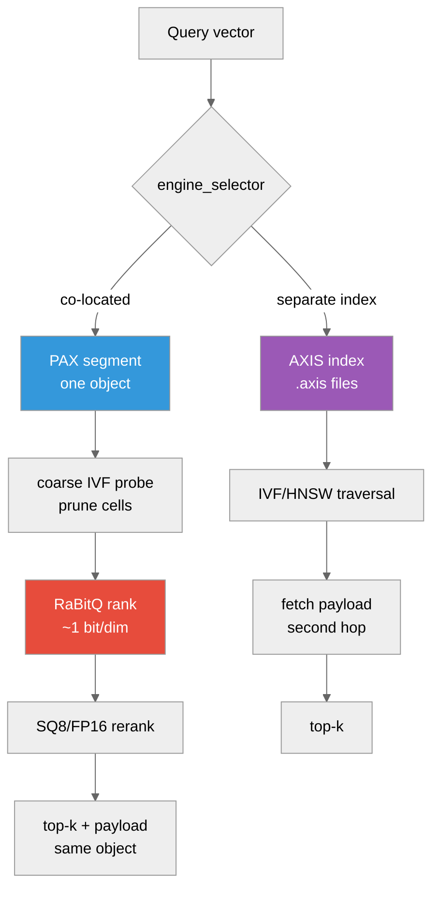

# Choosing a Vector Index: PAX IVF vs AXIS IVF

**And how to measure which one wins on *your* data**



---

## Overview

ProximaDB ships **two** physical shapes for vector retrieval, and they are not
redundant — they optimise different cost terms.

| | **PAX IVF** (co-located) | **AXIS IVF** (separate index) |
|---|---|---|
| Where vectors live | In the data object, as typed stripes | In the data object |
| Where the index lives | *No separate index* — IVF coarse directory inside the segment footer | Separate persisted `.axis` files |
| Payload fetch | Same object, same GET family | Second hop after the index returns ids |
| Quantization | RaBitQ (~1 bit/dim) → SQ8/FP16 rerank, in-segment | Index-side (IVF/HNSW/flat) |
| Filtered search | Metadata stripes co-resident → prune before ranking | Needs a join or post-filter |
| Default | **On** (PAX + RaBitQ + row-group layout) | Feature `axis`, **on** by default |

The shapes map onto the industry split: PAX IVF is the "one object, many
column groups" model; AXIS IVF is the pgvector/LanceDB model where the index is
a separate artifact beside the data.

## When to use which

**Prefer PAX IVF when:**

* **Queries carry predicates.** Metadata lives in the same object as the
  vectors, so a filtered ANN query prunes before ranking and never pays a join.
  Measured on SIFT1M-100k with 8 partitions: filtered recall@10 **0.9907** —
  i.e. filtering did not cost recall.
* **You need the payload with the hit.** Vector search returns ids; apps want
  records. Co-location keeps that in the same GET family rather than a second
  round trip.
* **Object storage is the substrate.** The cost model is round-trip-dominated,
  and one object means one footer, one coarse directory, one survivor fetch
  plan.

**Prefer AXIS IVF when:**

* **The corpus is static and the index is reused across many queries**, so a
  purpose-built traversal structure amortises its own storage.
* **You want index shapes PAX does not implement** (HNSW graph traversal, Annoy
  trees, flat exact) — see `src/index/axis/`.
* **The payload is large relative to the vector** and you do *not* want payload
  bytes anywhere near the ranking path.

**A caution that applies to both.** Index choice is secondary to the
**I/O budget** (below). In our own measurements, moving the storage budget from
4 MiB to 8 MiB cut GETs/query by 22% at identical recall, while the IVF
coalescing and nprobe knobs were *inert* on the un-clustered path. Measure the
budget first.

## The I/O budget dominates — and it is tunable

Per-backend defaults (`crates/storage/proximadb-storage-common/src/iops_budget.rs`):

| Backend | min | target | max |
|---|---|---|---|
| Azure (`az`/`adls`/`abfs`) | 512 KiB | **4 MiB** | 4 MiB |
| S3 (`s3`/`http(s)`) | 512 KiB | **8 MiB** | 16 MiB |
| GCS (`gs`/`gcs`) | 512 KiB | **8 MiB** | 16 MiB |
| Local / MinIO | 256 KiB | 1 MiB | 8 MiB |
| Generic cloud | 512 KiB | 4 MiB | 8 MiB |
| Unknown | 512 KiB | 2 MiB | 8 MiB |

Two things worth knowing:

1. **Azure's 4 MiB is a conservative planner policy, not a platform limit.** The
   source says so explicitly: *"not a Blob billing quantum or a proven SDK range
   limit"* (tracked by TD-SEARCH-3). If you have wire evidence for your account,
   raise it.
2. **You can override it per location**, which is the supported way to escape a
   default you have measured past:

```toml
[[storage.storage_locations]]
url = "az://mycontainer/vectors"
  [storage.storage_locations.io_budget]
  min    = 524288      # 512 KiB
  target = 8388608     # 8 MiB  — override the 4 MiB Azure default
  max    = 16777216    # 16 MiB
```

Registered at boot and resolved by **longest matching URL prefix**, so you can
tune one prefix without touching the rest.

## Benchmark it on your own dataset

The harness is `tests/sift_pax_recall_ratchet_test.rs`. It measures recall
against ground truth **and** the I/O cost in the same run, which is the point:
recall alone cannot tell you whether a configuration is affordable.

### Dataset format

Plain-binary TEXMEX `.fvecs` / `.ivecs` (little-endian, parsed with std only —
no HDF5 dependency):

| File | Shape | Purpose |
|---|---|---|
| `<dir>/sift_base.fvecs` | N × dim | the corpus to insert |
| `<dir>/sift_query.fvecs` | Q × dim | query set |
| `<dir>/sift_groundtruth.ivecs` | Q × 100 | true neighbours (optional) |

If ground truth is absent, or you insert a subset (`PROXIMADB_SIFT_N` below),
the harness computes a **brute-force oracle over the inserted rows** instead —
so your own corpus works without precomputed neighbours.

### Run it

```bash
PROXIMADB_SIFT_DATASET_DIR=/path/to/your/vectors \
PROXIMADB_SIFT_N=100000 \
PROXIMADB_SIFT_QUERIES=1000 \
PROXIMADB_RECALL_DATASET_REQUIRED=1 \
  cargo test --release --features io-trace \
    --test sift_pax_recall_ratchet_test -- --nocapture
```

Add `,aws` to `--features` and set `PROXIMADB_OBJECT_STORE_URL=s3://bucket/prefix`
(plus `AWS_ENDPOINT`/credentials) to measure under a **cloud** I/O budget rather
than the local one. Without this you are measuring the 1–4 MiB local profile,
which understates the GET savings a cloud budget gives you.

### Knobs

| Env | Effect |
|---|---|
| `PROXIMADB_SIFT_DATASET_DIR` | corpus dir (**unset → test skips**) |
| `PROXIMADB_SIFT_N` | insert only the first N base vectors |
| `PROXIMADB_SIFT_QUERIES` | query count (default 1000) |
| `PROXIMADB_SIFT_RECALL_FLOOR` | fail below this recall@10 (default 0.90) |
| `PROXIMADB_RECALL_DATASET_REQUIRED` | fail instead of skip when the corpus is missing |
| `PROXIMADB_OBJECT_STORE_URL` | measure against a cloud/emulator base |
| `PROXIMADB_SIFT_COALESCED_BYTE_BUDGET` | fail above this bytes/query |
| `PROXIMADB_COUNT_FS_IO=1` | process-global GET/byte counters |
| `PROXIMADB_PAX_READ_COARSE_NPROBE` | coarse cells probed (recall↔GET trade) |
| `PROXIMADB_PAX_BLOCK_CLUSTER=1` + `PROXIMADB_PAX_FLUSH_CLUSTER=ivf` | train the IVF coarse directory at flush |

### Reading the output

```
SIFT PAX cascade recall@10 [rg_layout] = 0.9896 over 1000 queries (N=100000, floor=0.9)
SIFT paired exact/ANN evidence: ... exact GET/range-GET/bytes/compute-ms per pair=5.00/0.00/74961193/189.47,
                                    ANN   GET/range-GET/bytes/compute-ms per pair=53.97/53.97/25297445/20.07
```

Four numbers decide a configuration, and you want them **together**:

* **recall@10** — is it still correct?
* **GETs/query** — the round-trip (DEPTH) term; dominant on object storage.
* **bytes/query** — the egress (BYTES) term.
* **bytes/GET** (derived) — tells you whether your budget is sized right. Far
  below `target` means you are paying round-trips for small reads.

## Reference measurements

SIFT1M subset, N=100 000, dim 128, top_k 10, 1000 queries, RaBitQ→SQ8 cascade
with the row-group layout (the shipped default). Reproduced identically on CI
and a workstation:

| Configuration | recall@10 | GETs/query | bytes/query | bytes/GET |
|---|---|---|---|---|
| Exact scan (no ANN) | 1.0 by definition | **5.00** | 75.0 MB | 15.0 MB |
| ANN, local budget (4 MiB) | 0.9896 | 53.97 | 25.3 MB | ~469 KB |
| **ANN, S3 budget (8 MiB)** | 0.9896 | **42.03** | 26.9 MB | ~639 KB |
| ANN, filtered (8 partitions) | 0.9907 | — | — | — |

Reading it:

* ANN buys **−66% bytes** and **−85% compute** over an exact scan, but costs
  **~8–11× more round-trips**. On object storage that trade is the whole
  decision, and it is why the budget matters more than the knobs.
* The **8 MiB S3 budget cut GETs 22% for +6% bytes at identical recall** — a
  straight DEPTH-for-BYTES win, and the clearest single lever we measured.
* With the IVF coarse directory **trained**, the ledgered 1M-scale sweep records
  **81 GETs / 92 ms probed vs 108 GETs / 144 ms unprobed** at recall
  0.9860–0.9870 (ratchet 0.984) — better on every axis. Untrained, nprobe does
  nothing, which is the trap: train before you tune.

## Caveats

* Everything above is **measured on one corpus** (SIFT1M, dim 128, L2). Your
  dimensionality, clustering and filter selectivity will move these numbers —
  which is exactly why the harness takes your dataset.
* Latency under `PROXIMADB_OBJECT_STORE_URL` against a local emulator includes
  HTTP overhead and is **not** comparable to the local-filesystem latency
  column. Compare GETs and bytes across backends; compare latency only within
  one backend.
* `sift_ivf2_coarse_probe_recall_ratchet` currently fails a precondition
  (it passes a collection *name* where a catalog object id is required). It is
  `#[ignore]`d, so CI does not catch the drift. Use
  `sift_ivf2_probe_release_bakeoff_eval` for the clustered arm until that is
  fixed.

## See also

* `docs/12-design/RABITQ_PAX_SEGMENT_MIGRATION_PLAN_2026_06.adoc` — the cascade's phased rollout
* `docs/12-design/VECTOR_LAKEBASE_ALIGNMENT_2026_05_28.adoc` — the separation/lakehouse trade-offs
* `crates/storage/proximadb-storage-common/src/iops_budget.rs` — budget resolution order
* `.github/workflows/qa-gate.yml` job `sift-pax-recall` — how CI runs this
