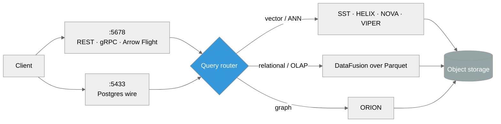

# ProximaDB

**The context database** — vectors, documents, graphs and observability in one system.

---

## Start here

| | |
|---|---|
| **[Quick Start](01-quick-start/index.md)** | Install, run your first query, and understand the moving parts |
| **[Guides](02-guides/index.md)** | Vector search, index selection, multi-model joins |
| **[Concepts](05-concepts/index.md)** | Quantization, the query planner, the unified WAL |
| **[API Reference](03-api-reference/index.md)** | REST, gRPC, Arrow Flight and pgwire surfaces |
| **[Operations](04-operations/index.md)** | Running and releasing ProximaDB |

## What makes it different

**One query surface, several engines.** You submit a query and the engine picks
the execution path — DataFusion's vectorised kernels for analytical scans over
Parquet, purpose-built engines for vector/ANN work, ORION for graph traversal.
You do not choose the engine; the planner does, and it discloses what it chose.

**Co-located vectors and metadata.** Vectors, payload and the coarse index live
in one object, so a filtered vector search prunes before it ranks and the
payload comes back without a second round trip. See
[Vector Index Selection & Benchmarking](02-guides/vector-index-selection-and-benchmarking.md)
for when that wins and when a separate index is the better shape — with
measurements you can reproduce on your own data.

**Designed against the cost of object storage.** Round-trips dominate, not CPU,
so the storage format, the codecs, the caches and the planner are tuned together
against measured per-query I/O rather than component microbenchmarks.

## Choosing a wire protocol

| Surface | Port | Use it for |
|---|---|---|
| Postgres wire | 5433 | SQL from any Postgres client or BI tool |
| REST | 5678 | Ergonomic HTTP, SDKs |
| gRPC | 5678 | Typed RPC, low overhead |
| Arrow Flight | 5678 | Bulk / columnar transfer, zero-copy |

All three of REST, gRPC and Arrow Flight are multiplexed on one port — they
coexist rather than competing.

!!! note "Supported surface"
    Code presence is broader than the supported product surface. For
    supported / beta / experimental status of a given feature, see
    `docs/SUPPORTED_SURFACE.adoc` in the repository.
